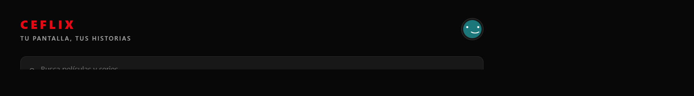
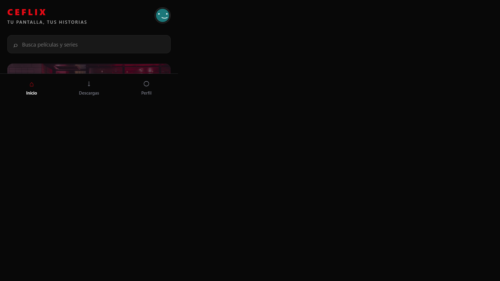

# Ceflix

## Informe del proyecto

Ceflix es una aplicación de entretenimiento y streaming inspirada visualmente en plataformas comerciales como Netflix, pero con una identidad propia. El nombre, el avatar, los textos y la organización de contenido pertenecen a Ceflix. El objetivo principal del proyecto es crear una experiencia de descubrimiento de películas y series utilizando React Native, Expo y NativeWind.

La aplicación está preparada para ejecutarse en dispositivos móviles mediante Expo Go y también en navegador web. La interfaz utiliza una composición oscura con rojo, blanco y gris, una paleta relacionada con las plataformas de streaming, pero aplicada a la marca Ceflix.

## Objetivos

- Crear una pantalla de inicio atractiva y funcional.
- Organizar las películas en filas horizontales por categorías.
- Incorporar series populares y contenido para niños.
- Permitir navegar entre Inicio, Descargas y Perfil.
- Probar controles táctiles en móvil y controles con cursor en web.
- Mantener el diseño adaptable a distintos tamaños de pantalla.
- Aplicar estilos con NativeWind sin utilizar `StyleSheet.create()`.

## Pantalla de Inicio

La pantalla Inicio es el punto central de Ceflix. Está diseñada para que el usuario pueda encontrar contenido rápidamente y comenzar a reproducirlo sin tener que navegar por muchas pantallas.

### Encabezado

El encabezado muestra el logotipo de Ceflix, el texto descriptivo `Tu pantalla, tus historias` y el avatar del usuario. El logotipo funciona como botón y permite regresar a Inicio. El avatar también funciona como acceso directo al apartado Perfil.

### Buscador

La pantalla incluye un `TextInput` funcional con el texto `Busca películas y series`. A medida que el usuario escribe, las filas filtran los títulos que coinciden con la búsqueda. Esto permite encontrar contenido por nombre sin agregar una pantalla independiente.

### Recomendación destacada

La sección `Ceflix recomienda` presenta una película destacada con imagen, título, descripción y controles de acción. La recomendación cambia automáticamente cada cinco segundos entre diferentes películas. El título, la imagen y la sinopsis se actualizan juntos para evitar mostrar información de una película sobre otra.

El botón `Reproducir` cambia su estado a `Reproduciendo`. También existe un botón para agregar el contenido a una lista, representado por el símbolo `+`.

### Carrusel Seguir viendo

La sección `Seguir viendo` muestra contenido que el usuario dejó pendiente. Cada tarjeta incluye una imagen, el episodio y el tiempo aproximado restante. La barra roja representa el progreso de reproducción.

El control `Desliza para ver más` es interactivo y desplaza el carrusel horizontal para mostrar los siguientes títulos. Esta sección contiene, entre otros, `The Last Horizon`, `Dark`, `One Piece`, `Bridgerton` y `La casa de papel`.

### Categorías de películas

Las películas se organizan en filas independientes para evitar mezclar géneros. Actualmente están disponibles estas categorías:

- Películas de acción.
- Ciencia ficción y fantasía.
- Drama y misterio.
- Comedia y aventura.

Cada fila tiene un carrusel horizontal propio y botones `‹` y `›`. El botón izquierdo regresa por bloques hacia las películas anteriores y el botón derecho avanza hacia las siguientes. Las tarjetas tienen un tamaño constante para que la página conserve una composición ordenada.

### Series populares

Las series están separadas de las películas en la fila `Series populares`. Esta sección contiene títulos como `The Rookie`, `Policías de Chicago`, `Bones`, `Rick y Morty`, `El joven Sheldon`, `Titanes`, `Merlina`, `La casa de papel`, `The Witcher`, `Bridgerton`, `Lupin`, `Cobra Kai` y `The Crown`.

### Películas para niños

El contenido infantil se encuentra en una fila específica llamada `Películas para niños`. Así se diferencia del resto del catálogo y resulta más fácil para el usuario identificar contenido familiar. La fila incluye títulos como `Klaus`, `Más allá de la Luna`, `Leo`, `Matilda`, `Vivo`, `Paddington`, `El monstruo marino`, `La familia Addams`, `Hotel Transylvania`, `Trolls` y `La patrulla canina`.

## Descripciones de contenido

Al pasar el cursor sobre una tarjeta en la versión web aparece una pequeña descripción de la película o serie. Las descripciones son específicas para cada título; no se utiliza el mismo texto genérico en todas las tarjetas. Por ejemplo:

- `Dune: Parte dos` muestra una sinopsis relacionada con Paul Atreides y los Fremen.
- `Glass Onion` explica el misterio que ocurre en una isla privada.
- `Nimona` presenta la alianza entre un caballero acusado y una joven cambiante.
- `Klaus` describe la historia del cartero y el fabricante de juguetes.
- `Rick y Morty` explica sus aventuras por dimensiones desconocidas.

En dispositivos táctiles, donde no existe cursor, las tarjetas siguen siendo pulsables y mantienen la información principal mediante el título y la categoría.

## Apartado de Descargas

La vista `Descargas` fue diseñada para que el contenido descargado se identifique claramente. Cada tarjeta muestra:

- La etiqueta verde `DESCARGADA`.
- Una barra de progreso completa.
- La calidad del archivo, como `HD`, `Full HD` o `4K UHD`.
- El peso aproximado del archivo, expresado en `MB` o `GB`.
- El texto `Disponible sin conexión`.
- El botón `Ver ahora`.

El botón `Ver ahora` es funcional y muestra una confirmación del contenido seleccionado. La vista utiliza una cuadrícula responsive: en móvil las tarjetas se distribuyen en dos columnas y en pantallas grandes se aprovecha el ancho disponible con más columnas.

Entre los contenidos descargados se encuentran `Dune: Parte dos`, `Misión de rescate 2`, `El irlandés`, `Klaus`, `El monstruo marino`, `Hotel Transylvania`, `La familia Addams` y `La patrulla canina`.

## Apartado de Perfil

El apartado `Perfil` presenta la información del usuario y opciones de administración similares a las que se encuentran en una plataforma de streaming real.

### Datos personales

El perfil pertenece a:

| Campo | Información |
| --- | --- |
| Nombre | Camilo |
| Apellido | Gomez |
| Correo | gomezcamilo347@gmail.com |
| Teléfono | +57 3235911772 |
| Plan | Ceflix Premium |

El avatar utilizado en el perfil es una ilustración local con fondo verde azulado, ojos blancos y una sonrisa. Se utiliza el mismo avatar en el encabezado y en la ficha del perfil para mantener consistencia visual.

### Secciones de cuenta

El perfil incluye las siguientes secciones:

- Descripción general.
- Membresía.
- Seguridad.
- Dispositivos.
- Perfiles.

Estas opciones se muestran como botones y responden al pulsarlas con una confirmación visible. También se incluye el bloque `Vínculos rápidos`, con acciones como cambiar de plan, agregar una forma de pago, administrar dispositivos, actualizar contraseña, transferir un perfil, ajustar controles parentales y editar la configuración.

## Diseño responsive

Ceflix utiliza clases responsivas de NativeWind para adaptarse a móvil y web. En pantallas pequeñas se mantienen márgenes reducidos, tarjetas en dos columnas y navegación inferior cómoda para el pulgar. En pantallas grandes se amplía el contenido, se distribuyen las tarjetas en más columnas y las secciones aprovechan el ancho disponible.

También se aplicaron restricciones para evitar el desbordamiento horizontal de los carruseles. El documento y el contenedor principal respetan el ancho del viewport, mientras que cada carrusel conserva su desplazamiento interno. El zoom CSS se mantiene en `100%` mediante `html { zoom: 1; }`.

## Componentes y tecnologías

- **Expo SDK 57:** entorno de ejecución para React Native.
- **React Native:** componentes base para construir la interfaz.
- **NativeWind:** estilos utilitarios con clases `className`.
- **TypeScript:** tipado estático para estados, datos y componentes.
- **React Native SVG:** creación del avatar local multiplataforma.
- **Expo Web:** ejecución de la aplicación en navegador.

Componentes Core utilizados:

- `SafeAreaView` para respetar las áreas seguras del dispositivo.
- `ScrollView` vertical para toda la página.
- `ScrollView` horizontal para los carruseles.
- `TextInput` para la búsqueda.
- `Image` para banners, portadas y contenido remoto.
- `Pressable` para botones con estados de opacidad y acciones.
- `Text` y `View` para la estructura visual.

## Ejecución del proyecto

Instalar dependencias:

```bash
npm install
```

Iniciar el proyecto para Expo Go:

```bash
npx expo start
```

Después de iniciar Metro, escanea el código QR desde Expo Go. El computador y el dispositivo móvil deben estar conectados a la misma red Wi-Fi.

Iniciar la versión web:

```bash
npm run web
```

Si el puerto predeterminado está ocupado, Expo puede proponer otro puerto disponible, por ejemplo `8082` o `8084`.

## Validación

El proyecto fue revisado con los siguientes comandos:

```bash
npx tsc --noEmit
npx expo-doctor
```

La validación de Expo terminó con `21/21 checks passed`. También se probaron en navegador:

- Cambio automático de la recomendación cada cinco segundos.
- Búsqueda de películas y series.
- Botones anterior y siguiente de los carruseles.
- Descripciones al pasar el cursor.
- Navegación entre Inicio, Descargas y Perfil.
- Botones `Ver ahora` de Descargas.
- Acciones del apartado Perfil.
- Adaptación a viewport de escritorio y móvil.

## Capturas de pantalla

### Vista principal



### Vista actual del proyecto



## Bitácora de auditoría de IA

La [Bitácora de Auditoría de IA](./INFORME_AI_LOG.md) contiene los prompts utilizados, los errores encontrados durante el desarrollo, las correcciones aplicadas, las decisiones técnicas y una reflexión sobre los aprendizajes obtenidos.

## Estructura principal

```text
ceflix/
├── App.tsx                 # Pantallas, datos y lógica de interacción
├── index.ts                # Punto de entrada de Expo
├── global.css              # Estilos globales de NativeWind y fondo web
├── tailwind.config.js      # Configuración de utilidades Tailwind
├── babel.config.js         # Transformación de NativeWind y Expo
├── metro.config.js         # Integración de NativeWind con Metro
├── nativewind-env.d.ts     # Tipos de className para TypeScript
├── screenshot.png          # Captura principal para la entrega
├── screenshot-inicio.png   # Evidencia de la pantalla Inicio
├── screenshot-descargas.png# Evidencia de Descargas
├── INFORME_AI_LOG.md       # Bitácora del proceso con IA
└── README.md               # Documentación del proyecto
```

## Estado del proyecto

Ceflix cuenta con una experiencia de streaming navegable, catálogo separado por categorías, series populares, contenido infantil, descargas con metadatos, perfil personalizado y soporte para navegador y Expo Go. Las imágenes del catálogo se cargan mediante URLs remotas y se recomienda disponer de conexión a internet para visualizar todas las portadas.# ceflix

